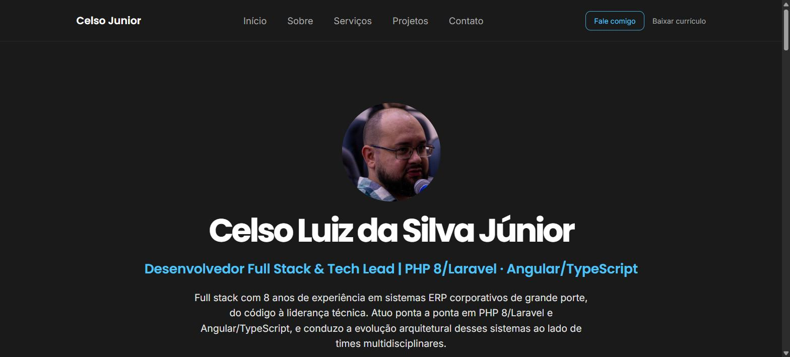

<p align="center">
  
</p>

<h1 align="center">celsojunior.dev.br</h1>

<p align="center">
  Site pessoal de portfólio — Angular 22, standalone components, signals e SSR.
</p>

<p align="center">
  <a href="https://celsojunior.dev.br">🔗 Ver site ao vivo</a>
</p>

<p align="center">
  
  
  
  
  <a href="https://github.com/celsojuniorsfs/celso-junior-web/actions/workflows/ci.yml">
    
  </a>
</p>

---

## Sobre o projeto

Portfólio pessoal de um desenvolvedor full stack com 8 anos de experiência em sistemas ERP corporativos de grande porte. Os sistemas em que atuei são internos de clientes e não podem virar screenshot de portfólio — então, em vez de prints, o site conta 3 cases técnicos (problema → solução → resultado) sobre o que foi construído, sem expor código, dados ou regra de negócio de ninguém.

É uma página única com navegação por âncora (Início, Sobre, Serviços, Projetos, Contato) — sem necessidade de rotas de verdade, já que não há mais de uma "página".

> O layout parte de um template Figma da comunidade ("Designer Developer Portfolio"). A implementação inteira — componentes, arquitetura, testes, acessibilidade, CI — é código meu, escrito do zero.

## Screenshot

<p align="center">
  
</p>

## Stack

| Camada | Tecnologia |
|---|---|
| Framework | [Angular 22](https://angular.dev) — standalone components, signals, `input()`/`output()`, controle de fluxo nativo (`@if`/`@for`) |
| Estilo | [Tailwind CSS 4](https://tailwindcss.com) — design tokens custom via `@theme` em `src/styles.css` |
| Renderização | SSR com Express (`@angular/ssr`) + prerender em build time |
| Testes | [Vitest](https://vitest.dev) (builder oficial do Angular) |
| Linguagem | TypeScript, `strict` + `strictTemplates` ativos |
| CI | GitHub Actions — build + test em todo push/PR |
| Deploy | [Vercel](https://vercel.com), domínio próprio |
| Analytics | [Vercel Analytics](https://vercel.com/analytics) |

## Decisões de arquitetura

- **Página única, sem rotas de verdade** — `app.routes.ts` fica vazio; a navegação é por âncora (`#about`, `#services`...). O SSR ainda usa `RenderMode.Prerender` pra gerar HTML estático da única rota em build time, sem custo de servidor por request.
- **Componentes compartilhados, extraídos de uma revisão de arquitetura real** — `app-section-heading` (heading de seção, com variantes), `app-icon-badge` (wrapper de ícone) e `CARD_CHROME_CLASS`/`CONTACT_INFO` (constantes) eliminaram duplicação que existia entre 4–5 componentes antes dessa revisão. Ver `src/app/components/section-heading/`, `src/app/components/icon-badge/`, `src/app/shared/` e `src/app/data/`.
- **Acessibilidade como requisito, não opcional** — skip link, `:focus-visible` visível, `aria-label`/`aria-labelledby` em cada seção, `aria-expanded`/`aria-controls` no menu mobile, meta de zero violações AXE / WCAG AA.
- **`strict` + `strictTemplates`** — tipagem estrita no TypeScript e nos templates, não só no código.

## Estrutura de pastas

```
src/app/
├── app.ts                    # Shell raiz — importa as seções
├── app.html                  # Skip link + <header> + <section> por âncora + <footer>
├── app.routes.ts             # Vazio — página única, sem rotas
├── app.routes.server.ts      # Prerender da rota única
├── components/
│   ├── header/                 # Navegação fixa + menu mobile
│   ├── hero/                   # Nome, tagline, avatar
│   ├── about/                  # Bio expandida
│   ├── services/                # 5 cards de serviço (+ service-card)
│   ├── skills/                   # Chips da stack principal
│   ├── projects/                  # 3 cases técnicos (+ project-card)
│   ├── contact/                    # Cards de contato
│   ├── footer/                      # Links rápidos + copyright
│   ├── section-heading/              # Heading de seção compartilhado
│   └── icon-badge/                    # Wrapper de ícone compartilhado
├── data/
│   └── contact-info.ts        # Fonte única de e-mail, LinkedIn, WhatsApp e CV
└── shared/
    └── card-chrome.ts         # Classe de card compartilhada
```

## Rodando localmente

```bash
npm install
ng serve
```

Abre em `http://localhost:4200`, com reload automático ao salvar.

```bash
ng build   # build de produção em dist/
ng test    # testes com Vitest
```

## Testes & CI

O GitHub Actions roda `ng build` e `ng test` em todo push e pull request — o badge no topo mostra o status do último run. Veja `.github/workflows/ci.yml`.

## Acessibilidade

- Skip link pro conteúdo principal
- Foco sempre visível (`:focus-visible`)
- `aria-label`/`aria-labelledby` em todas as seções
- Menu mobile com `aria-expanded`/`aria-controls`
- Meta: zero violações no AXE, conformidade WCAG AA

## Direitos

Código estrutural (componentes, arquitetura, configuração) pode servir de referência. O conteúdo pessoal — foto, biografia, textos dos cases e currículo em `public/` — não é livre para reuso.
